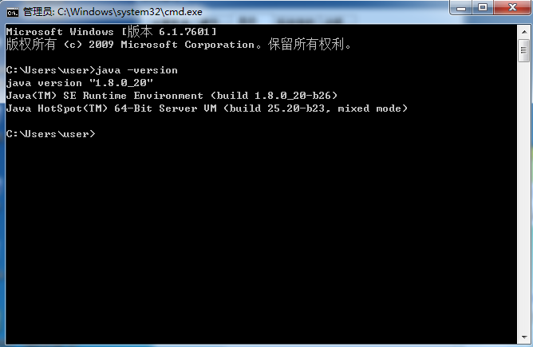

###JAVA环境安装

 1. 安装JDK
     双击JDK
     
 2. 配置JDK
     + 配置JAVA_HOME=C:\Program Files\Java\jdk1.8.0_20   
     + 配置PATH=C:\Program Files\Java\jdk1.8.0_20\bin
     
 3. 检查JAVA环境的配置
     打开CMD输入java -ersion,得到以下图片

    

 4.  Hello.java
         public class Hello{
	     public static void main(String[] args){
		   System.out.println("Hello Java !");
	     }
          }
